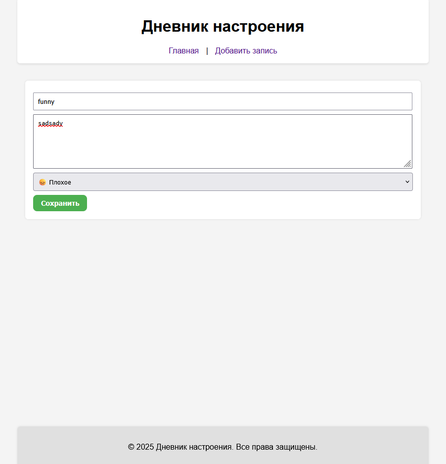

# Индивидуальная работа: Дневник настроения

Веб-приложение для создания, просмотра и анализа личных записей с упором на настроение и эмоциональное состояние. Удобный интерфейс и простая структура позволяют отслеживать изменения в самочувствии и поведении с течением времени.

## Установка и запуск проекта

### Зависимости

Перед запуском убедитесь, что у вас установлен Node.js (v18 или новее) и npm.

### Установка

1. Клонируйте репозиторий:

```bash
git clone https://github.com/LuciferDevV/indi_work_react
cd diary-app
````

2. Установите зависимости:

```bash
npm install
```

3. Запустите приложение:

```bash
npm run dev
```

4. Приложение будет доступно по адресу `http://localhost:5173/`.

## Авторы

* **\Certcov Vladislav**
* **\Belioglo Alina**  

## Описание проекта

Проект "Дневник настроения" создан для того, чтобы пользователь мог:

* Добавлять, удалять, редактировать записи с текстом и эмоциональной меткой.
* Просматривать записи по дате.
* Перейти к детальному просмотру каждой записи.
* Видеть сводную информацию по записям за месяц.
* Использовать фильтрацию по дате и эмоциям.

Интерфейс оптимизирован под фиксированный заголовок и подвал. Используются стилизация через CSS и библиотека `react-router-dom` для маршрутизации.

## Структура приложения

* **`/pages/Home.jsx`** — главная страница со списком записей и фильтрами.
* **`/pages/Create.jsx`** — форма создания новой записи.
* **`/pages/EntryPage.jsx`** — страница отдельной записи.
* **`components/`** — переиспользуемые элементы (карточки, фильтр, статистика и т.д.).
* **`App.jsx`** — маршрутизация, фиксированный `header` и `footer`.
* **`main.css`** — стилизация интерфейса, включая темы, кнопки, скелетоны и т.д.

## Примеры использования

### Скриншоты приложения

* Главная страница: 

* Поиск по заголовку: 

* Поиск по фильтрам настроения и даты: 

* Добавление новой записи:  

* Отображение полной записи: 

* Редактирование записи: 

* Удаление записи: 

* Сообщение зависимое от процентного соотношения настроения за месяц:  


## Использованные источники

* Документация React: [https://reactjs.org](https://reactjs.org)
* React Router: [https://reactrouter.com](https://reactrouter.com)
* Иконки и эмодзи: [https://emojipedia.org/](https://emojipedia.org/)

## Дополнительная информация

* Все компоненты поддерживают адаптивность.
* Приложение написано с учетом возможного расширения (например, добавление графиков или темной темы).
* Используется `Skeleton`-анимация для улучшения UX при загрузке.
